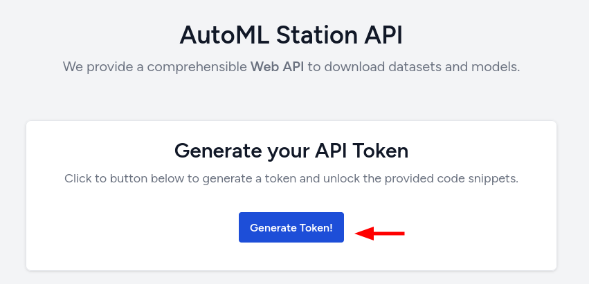
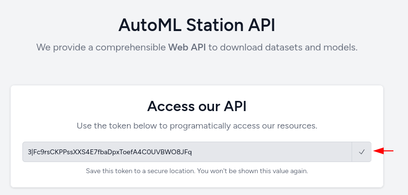
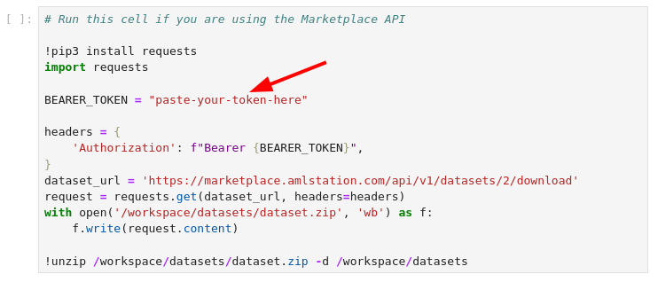
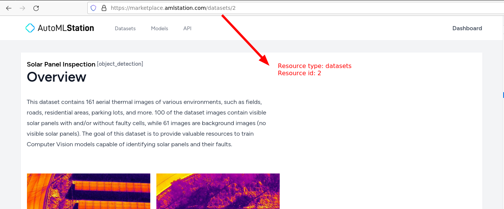

# AML Station's Marketplace API

Our web API allows users to download datasets and models programatically.

In order to use our API, you will need to

1. [Create an account](https://marketplace.amlstation.com/register) on [log in](https://marketplace.amlstation.com/login) to AutoML Station's Marketplace;
2. Access the [API page](https://marketplace.amlstation.com/api) and click on the **Generate Token** button;

    
3. Copy the resulting Token (make sure to save it in a secure place);

    
4. Paste the Token to the `BEARER_TOKEN` variable in notebook cells;

    

## Finding the correct API URL for datasets and models

Our API URLs have the following structure:

- https://marketplace.amlstation.com/api/v1/ **RESOURCE_TYPE** / **RESOURCE_ID** /download

Where the **RESOURCE_TYPE** is either `models` or `datasets`, and the **RESOURCE_ID** can be found in its webpage URL.

